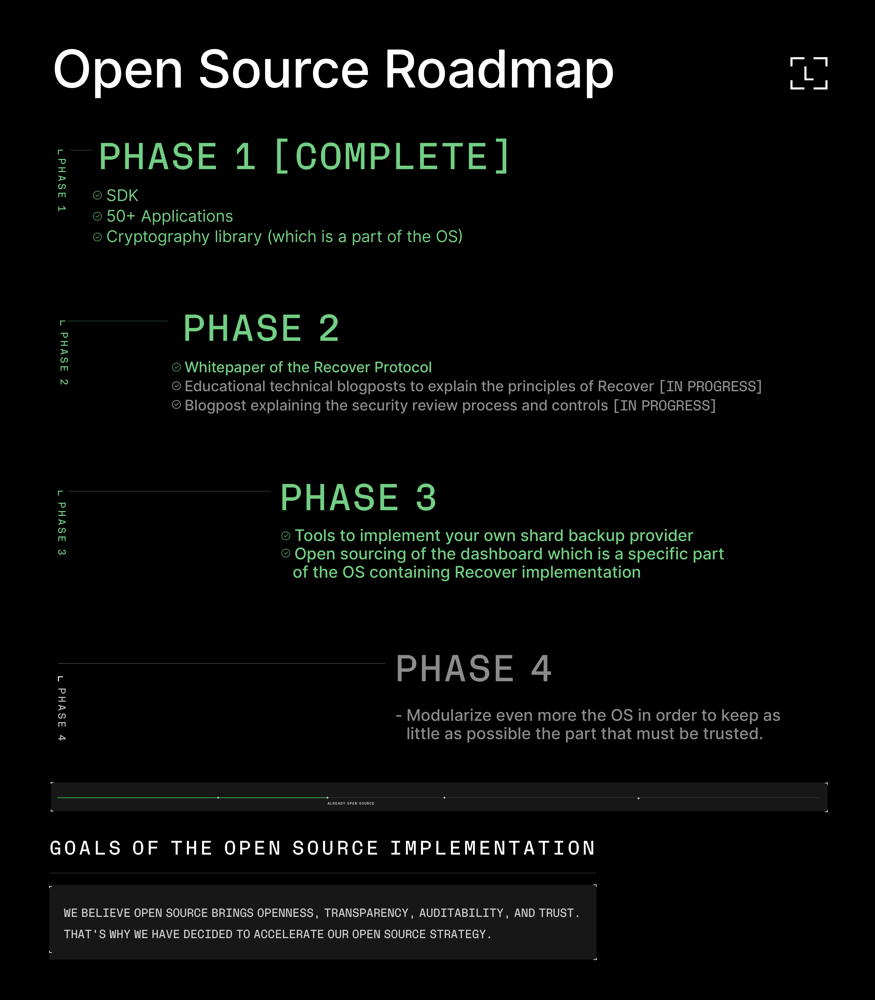

# Ledger Recover Cryptographic Protocol White Paper

Welcome to the GitHub repository for the Ledger Recover Cryptographic Protocol White Paper! This repository contains the complete text of the technical white paper that delves into the system design, architecture, and operational flows of Ledger Recover.

## Overview

Ledger Recover is an advanced solution for the backup and restoration of your device seed, built upon a robust and resilient cryptographic protocol. The purpose of this repository is to provide open access to the detailed examination of Ledger Recover, with a strong focus on its design and security goals, as well as the three primary operational flows - backing up your seed, restoring it on a new device, and securely deleting your backups.

Publishing this white paper is yet another step in our open-source roadmap, aiming at opening as much as possible of our technical stacks to the crypto community.

## Contents

In this repository, you will find a PDF version of the [white paper](Ledger%20Recover%20Technical%20White%20Paper.pdf) split in the following sections:

- Introduction: An overview of the Ledger Recover system and the objectives of the white paper.
- System Design: Detailed breakdown of the architectural features and components of Ledger Recover.
- Design Goals: Overview of the key design and security goals of the Ledger Recover cryptographic protocol.
- Operational Flows: Detailed explanations of the three main operational flows of Ledger Recover.

## Contributing

While the white paper is primarily an informational document, we welcome any corrections or suggestions for improvement. If you spot a typo, a sentence that could be clearer, or even a significant error in our explanations, please feel free to raise an issue.

## Contact

For any inquiries or feedback related to the Ledger Recover Cryptographic Protocol White Paper, feel free to [contact us](mailto:ledger-recover-contact@ledger.fr).
